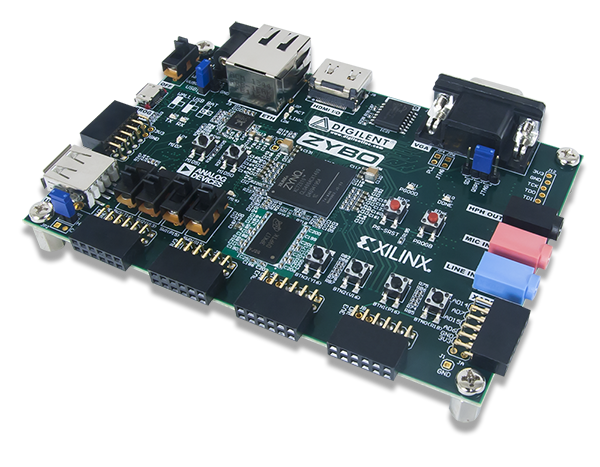

<div align="center">
    
  </a>
<h3 align="center">Embedded Real-Time Systems</h3>
<h4 aling="center">Assignments!</h4>
  <p align="center">
    <br />
  </p>
</div>

## Long Paths

Enable long paths for git by

```
git config --system core.longpaths true
```

## Branch Naming

Assignment branches should be named as follows:

```
assignment/a<x>-<y.z>
```

where x refers to the assignment, and y, z refer to the individual task and subtask respectively. E.g. a branch for assignment 1, task 3.1 should be named:

```
assignment/a1-3.1
```

putting `assignment/` before the branch anem essentially puts the branch in a `assignment` folder. If we want to use CI (pipelines) later, we can create special rules for assignment branches.

For branches unrelated to assignments, use `-` as spaces between words.

## Merging

**ONLY** fast-forward merging onto _main_ is allowed. This means that if the main branch moves during branch development, rebasing is necessary before merging. 

No merge commits allowed.

2 approvals required for PR's for _extreme code review hygge_.

## Folder structure

```
+---media
+---systemc-3.0.0
¦   +---lib
¦   +---src
+---systemc_template
```

In `systemc-3.0.0` the required src/inc files and compiled systemc.lib are located for relative inclusion in Visual Studio projects.

In `systemc_template` a bare Visual Studio project is located. This should remain untouched and only be used for copying for new assignments.

For new assignments we should copy `systemc_template` and rename it as `assignment-x`.

## Documentation

Inside each assignment folder the respective `.pdf` detailing the assignment should be included.

## Vivado HLS Patch

For _some_ reason Vivado HLS 2017 has an integer overflow error when it assigns a date to an IP during `export RTL`. See [Link]([link](https://adaptivesupport.amd.com/s/article/76960?language=en_US)).

Patch is located in `utilities`.